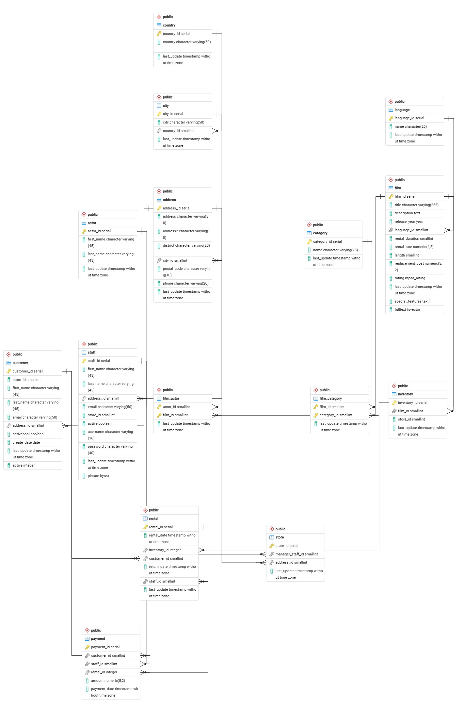

# SQL Joins & Relational Database Analysis

## Overview

This project explores the `dvdrental` sample database using SQL JOINs to answer real business questions. It covers relationship discovery (primary/foreign keys), all four core JOIN types, and a set of business queries that combine data across multiple related tables.

## Dataset

**Source:** [PostgreSQL Sample Database (dvdrental)](https://neon.com/postgresql/getting-started/sample-database)

Restored via pgAdmin's Restore tool (`Format: Custom or tar`) from `dvdrental.tar`. Contains 15 tables covering films, actors, customers, staff, stores, inventory, rentals, and payments.

## Relationship Diagram
The following Entity Relationship Diagram (ERD) was generated using pgAdmin 4 and illustrates the relationships between the tables in the `dvdrental` database.

  

The ERD shows:

- Primary and foreign key relationships between tables.
- One-to-one, one-to-many, and many-to-many relationships.
- Junction tables (`film_actor` and `film_category`) used to model many-to-many relationships.
- How customer, rental, payment, inventory, film, actor, category, store, address, city, and country tables are connected.

> **Note:** The diagram was generated using the built-in **ERD Tool** in pgAdmin 4.

## JOIN Types Used

| JOIN Type | What it does | Where it's used here |
|---|---|---|
| `INNER JOIN` | Returns only rows with a match in both tables | Used throughout — every query in this project uses `INNER JOIN` (written as `JOIN`), since every foreign key relationship in `dvdrental` is required (e.g. every rental has a customer, every payment has a rental) |
| `LEFT JOIN` | Returns all rows from the left table, with NULLs where no match exists in the right table | Not required for these 10 business questions since the data has no orphaned records, but relevant if checking for e.g. customers who have never rented anything |
| `RIGHT JOIN` | Mirror of `LEFT JOIN` — all rows from the right table | Not used in this task; equivalent result achievable by swapping table order in a `LEFT JOIN` |
| `FULL OUTER JOIN` | Returns all rows from both tables, matched where possible, NULLs elsewhere | Not used — no case here needed unmatched rows from both sides simultaneously |

**Why `INNER JOIN` for everything here:** All the relationships involved (customer → address, payment → rental → inventory → film, etc.) are enforced by `NOT NULL` foreign keys in the schema, meaning every child row is guaranteed to have a parent. An `INNER JOIN` and a `LEFT JOIN` would return identical results in this case — `INNER JOIN` is used because it more clearly communicates "this relationship is required," and it's marginally more efficient since Postgres doesn't have to track unmatched rows.

## How Each Business Question Was Solved

1. **Customer Name, Email, City, Country** 
Chained four tables (`customer → address → city → country`) since geographic data is normalized across three separate levels rather than stored directly on the customer record.
2. **Payment with Customer Name, Film Title, Amount** 
`payment` has no direct link to `film`; the path runs through `rental → inventory → film`, since `inventory` is what actually ties a physical copy to a film title.
3. **(Duplicate of Q2 in the task sheet)** 
Same query as above applies.
4. **Top 10 customers by total spent** 
Joined `customer` to `payment` directly (they do share a foreign key), then `GROUP BY` customer with `SUM(amount)`, sorted descending, capped with `LIMIT 10`.
5. **Film with Category and Rental Rate**  
`film` and `category` have a many-to-many relationship, resolved through the `film_category` junction table.
6. **Actors per film** 
Joined through `film_actor` (another junction table) to `actor`, then used `STRING_AGG` to collapse multiple actor rows into one comma-separated list per film.
7. **Film count per category** 
Joined `category → film_category`, then `COUNT()` the linked films, grouped by category name.
8. **Highest revenue by category** 
The longest chain in this task: `category → film_category → film → inventory → rental → payment`, since revenue data (`payment`) sits five tables away from `category`.
9. **Customers who rented more than 20 films** 
Joined `customer → rental`, grouped by customer, and filtered on the aggregated count using `HAVING` (not `WHERE`, since the filter applies to `COUNT()`, an aggregate).
10. **Highest revenue by city** 
Joined `city → address → customer → payment`, aggregating payment amounts by city.

**Bonus Challenge**:
Actor with highest rental revenue: `actor` and `payment` share no foreign key, so the path runs through every functional layer of the schema: `actor → film_actor → film → inventory → rental → payment`. This is the shortest possible chain, since each step is a required one-hop link (no shortcut exists in this schema).

## Business Insights

1. **Top customer spend concentration** — from Question 4, note how much the top-spending customer paid versus the average, and whether spend is fairly even across the top 10 or concentrated in a few big spenders.
2. **Revenue by category** — from Question 8, identify which film category actually drives the most revenue, and note whether it matches the category with the most films (Question 7) or diverges — a category with fewer films but higher revenue suggests higher rental rates or higher rental frequency.
3. **Geographic revenue distribution** — from Question 10, note whether rental revenue is concentrated in a handful of cities or spread evenly, which has direct implications for where a real DVD rental business would prioritize store locations or marketing spend.

## Repository Contents
- `README.md` — this file
- `joins.sql` — all SQL queries (relationship discovery + 10 business questions + bonus challenge)
- `concept_check.md` — answers to the concept check questions
- `screenshots/` — ER diagram, query results, and successful execution of all JOIN queries

## Tools Used
- PostgreSQL 18
- pgAdmin 4 (including the built-in ERD tool)